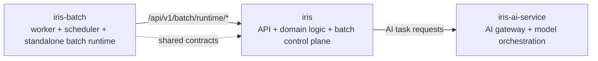

## ai-man-hedge-fund

Core service map:

### Repositories
- `iris`: main product/backend/frontend repository
- `iris-batch`: standalone batch worker and scheduler runtime
- `iris-ai-service`: isolated AI service for model/gateway execution

### Current architecture intent
- `iris` owns business logic and API contracts
- `iris-batch` scales independently for async/batch execution
- `iris-ai-service` isolates model/provider integration from product services
