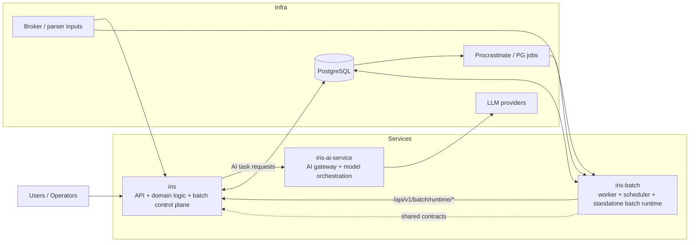

## ai-man-hedge-fund

Core service + infra map:

### Repositories
- `iris`: main product/backend/frontend repository
- `iris-batch`: standalone batch worker and scheduler runtime
- `iris-ai-service`: isolated AI service for model/gateway execution

### Current architecture intent
- `iris` owns business logic, API contracts, and control-plane state
- `iris-batch` scales independently for async/batch execution while reusing backend runtime contracts
- `iris-ai-service` isolates model/provider integration from product services
- PostgreSQL remains the shared persistence/control substrate for the current runtime split
