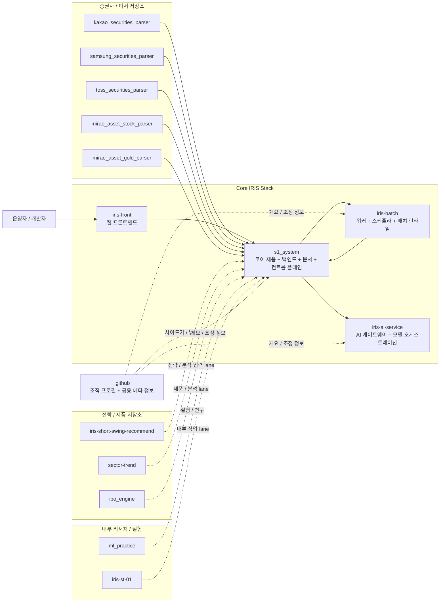

## ai-man-hedge-fund

IRIS 생태계를 만들고 운영하는 **AI-native 투자 플랫폼 조직**입니다.  
현재 중심은 **IRIS 제품 스택**(코어 제품, 배치 런타임, AI 게이트웨이)이며, 그 주변에 증권사 파서, 전략/사이드카, 리서치 저장소가 연결된 구조입니다.

## 생태계 관계도

## 저장소 목록

| 저장소 | 역할 | 비고 |
|---|---|---|
| `s1_system` | 메인 IRIS 제품 저장소 | 백엔드/API/도메인 로직/문서/컨트롤 플레인 중심 |
| `iris-front` | 웹 프론트엔드 | 코어 백엔드와 분리된 제품 UI |
| `iris-batch` | 배치 런타임 | 워커/스케줄러/런타임 분리 |
| `iris-ai-service` | AI 게이트웨이 서비스 | 모델/프로바이더 연동 분리 |
| `kakao_securities_parser` | 증권사 파서 | 카카오증권 ingest 경로 |
| `samsung_securities_parser` | 증권사 파서 | 삼성증권 ingest 경로 |
| `toss_securities_parser` | 증권사 파서 | 토스증권 ingest 경로 |
| `mirae_asset_stock_parser` | 증권사 파서 | 미래에셋 주식 ingest 경로 |
| `mirae_asset_gold_parser` | 증권사 파서 | 미래에셋 금현물 ingest 경로 |
| `iris-short-swing-recommend` | 제품 / 전략 사이드카 | 단기 스윙 추천 lane |
| `sector-trend` | 전략 / 분석 | 섹터 트렌드 연구 / 시그널 |
| `ipo_engine` | 제품 / 분석 lane | IPO 관련 제품 또는 분석 surface |
| `ml_practice` | 리서치 샌드박스 | 일반 ML 실험 |
| `iris-st-01` | 내부 보조 lane | IRIS 관련 내부 작업 저장소 |
| `.github` | 조직 프로필 / 메타 저장소 | 공용 개요 및 조직 차원 메모 |

## 기능별 그룹

### 1. Core IRIS runtime
- `s1_system`
- `iris-front`
- `iris-batch`
- `iris-ai-service`

### 2. 외부 ingest / parser layer
- `kakao_securities_parser`
- `samsung_securities_parser`
- `toss_securities_parser`
- `mirae_asset_stock_parser`
- `mirae_asset_gold_parser`

### 3. 제품 / 전략 사이드카
- `iris-short-swing-recommend`
- `sector-trend`
- `ipo_engine`

### 4. 내부 리서치 / 실험
- `ml_practice`
- `iris-st-01`

## 현재 아키텍처 의도
- `s1_system`은 비즈니스 로직과 컨트롤 플레인의 중심 저장소입니다.
- `iris-front`는 웹 제품 surface를 코어 백엔드와 분리합니다.
- `iris-batch`는 비동기 실행과 배치 런타임을 독립적으로 확장하기 위한 저장소입니다.
- `iris-ai-service`는 모델 / 프로바이더 연동을 제품 코드에서 분리합니다.
- 증권사 파서 저장소는 각 broker별 책임을 좁게 유지해 코어 제품 저장소 비대화를 막습니다.
- 전략 / 리서치 저장소는 코어 런타임을 흔들지 않고 별도 진화할 수 있도록 분리합니다.

## 운영 메모
- 이 프로필 README는 **상위 개요 지도**이지, 전체 운영 매뉴얼은 아닙니다.
- 각 저장소의 상세한 빌드 규칙, 런타임 계약, 아키텍처 정책은 해당 저장소 내부 문서를 따릅니다.
