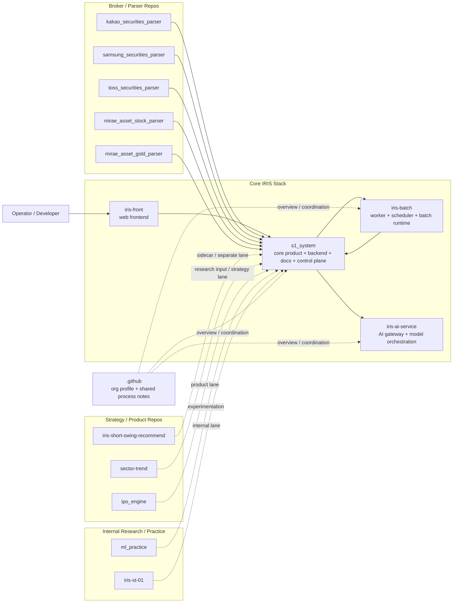

## ai-man-hedge-fund

AI-native investment platform organization for building and operating the IRIS ecosystem.
The current center of gravity is the **IRIS product stack** (core product, batch runtime, AI gateway), with supporting parser, strategy, and research repositories around it.

## Ecosystem relationship map

## Repository inventory

| Repository | Role | Notes |
|---|---|---|
| `s1_system` | Main IRIS product repository | Backend/API/domain logic/docs/control-plane center |
| `iris-front` | Web frontend | Product UI separated from core backend repo |
| `iris-batch` | Batch runtime | Worker/scheduler/runtime split from product core |
| `iris-ai-service` | AI gateway service | Model/provider isolation and orchestration |
| `kakao_securities_parser` | Broker parser | Kakao Securities ingest lane |
| `samsung_securities_parser` | Broker parser | Samsung Securities ingest lane |
| `toss_securities_parser` | Broker parser | Toss Securities ingest lane |
| `mirae_asset_stock_parser` | Broker parser | Mirae stock ingest lane |
| `mirae_asset_gold_parser` | Broker parser | Mirae gold ingest lane |
| `iris-short-swing-recommend` | Product / strategy sidecar | Short-swing recommendation lane |
| `sector-trend` | Strategy / analytics | Sector-trend research and signals |
| `ipo_engine` | Product / analytics lane | IPO-related product or research surface |
| `ml_practice` | Research sandbox | General ML experimentation repo |
| `iris-st-01` | Internal / supporting lane | Internal IRIS-related workstream |
| `.github` | Organization profile/meta repo | Shared overview and org-level notes |

## Functional grouping

### 1. Core IRIS runtime
- `s1_system`
- `iris-front`
- `iris-batch`
- `iris-ai-service`

### 2. External ingest / parser layer
- `kakao_securities_parser`
- `samsung_securities_parser`
- `toss_securities_parser`
- `mirae_asset_stock_parser`
- `mirae_asset_gold_parser`

### 3. Product / strategy sidecars
- `iris-short-swing-recommend`
- `sector-trend`
- `ipo_engine`

### 4. Internal research / experimentation
- `ml_practice`
- `iris-st-01`

## Current architecture intent
- `s1_system` is the primary business and control-plane repository.
- `iris-front` separates the web product surface from the backend core.
- `iris-batch` exists so async execution can scale and evolve independently.
- `iris-ai-service` isolates model/provider integration from product code.
- Parser repositories stay narrow and broker-specific rather than bloating the core product repo.
- Strategy / research repos remain separable so they can evolve without destabilizing the core runtime.

## Operating note
- This profile README is the **high-level map**, not the full operating manual.
- Repository-specific runtime contracts, build rules, and architecture details live inside each repository.
